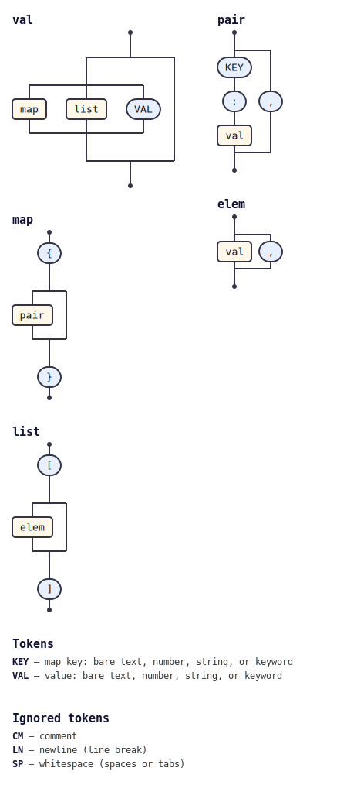

# @tabnas/jsonc

A JSONC (JSON-with-comments) grammar plugin for the
[tabnas](https://github.com/tabnas/parser) parsing engine. It teaches the
[jsonic](https://github.com/tabnas/jsonic) relaxed-JSON grammar to accept
the JSONC dialect: standard JSON plus single-line (`//`) and block
(`/* */`) comments, with optional trailing commas. Available for both
TypeScript/JavaScript and Go.

This repository contains:

| Path | Description |
|---|---|
| [`ts/`](ts/) | TypeScript / JavaScript implementation (canonical). |
| [`go/`](go/) | Go port. |

## Install

```bash
# TypeScript / JavaScript
npm install @tabnas/parser @tabnas/jsonic @tabnas/jsonc

# Go
go get github.com/tabnas/jsonc/go
```

## Example

TypeScript / JavaScript:

```js
import { Tabnas } from '@tabnas/parser'
import { jsonic } from '@tabnas/jsonic'
import { Jsonc } from '@tabnas/jsonc'

const j = new Tabnas().use(jsonic).use(Jsonc)

j.parse('{ "foo": /*hello*/true }')   // => { foo: true }
```

Go:

```go
package main

import (
    "fmt"

    tabnasjsonic "github.com/tabnas/jsonic/go"
    tabnasjsonc "github.com/tabnas/jsonc/go"
)

func main() {
    j := tabnasjsonic.Make()
    j.Use(tabnasjsonc.Jsonc)

    result, _ := j.Parse(`{ "foo": /*hello*/true }`)
    fmt.Println(result) // map[foo:true]
}
```

## Documentation

The docs follow the four [Diátaxis](https://diataxis.fr) quadrants, one
file each, per language:

| | TypeScript | Go |
|---|---|---|
| Tutorial (learning) | [ts/doc/tutorial.md](ts/doc/tutorial.md) | [go/doc/tutorial.md](go/doc/tutorial.md) |
| How-to guide (tasks) | [ts/doc/guide.md](ts/doc/guide.md) | [go/doc/guide.md](go/doc/guide.md) |
| Reference (API + options + syntax) | [ts/doc/reference.md](ts/doc/reference.md) | [go/doc/reference.md](go/doc/reference.md) |
| Concepts (explanation) | [ts/doc/concepts.md](ts/doc/concepts.md) | [go/doc/concepts.md](go/doc/concepts.md) |

The Go [concepts](go/doc/concepts.md) doc includes a "Differences from the
TS version" section.

## Grammar

The grammar is defined once in the top-level
[`jsonc-grammar.jsonic`](jsonc-grammar.jsonic) and embedded into both the
TypeScript ([`ts/src/jsonc.ts`](ts/src/jsonc.ts)) and Go
([`go/jsonc.go`](go/jsonc.go)) implementations by
[`ts/embed-grammar.js`](ts/embed-grammar.js) (run as part of `npm run
build`). Edit the `.jsonic` file, then re-embed — never edit the embedded
copies by hand.

The grammar as a railroad/syntax diagram, generated from the live grammar
with [`@tabnas/railroad`](https://github.com/tabnas/railroad):



ASCII version: [`ts/doc/grammar.txt`](ts/doc/grammar.txt).

## License

MIT. Copyright (c) Richard Rodger.
