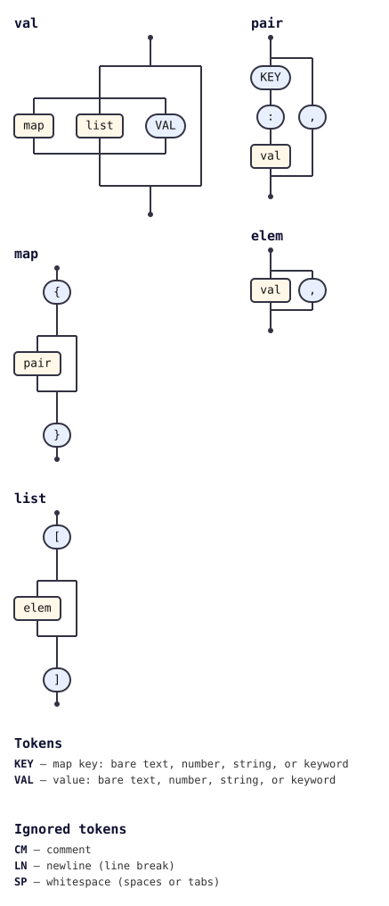

# @tabnas/jsonc

<!-- tabnas-badges -->
[](https://www.npmjs.com/package/@tabnas/jsonc)
[](https://github.com/tabnas/jsonc/actions/workflows/ci.yml)
[](https://pkg.go.dev/github.com/tabnas/jsonc/go)
[](https://tabnas.github.io/status/)
<!-- /tabnas-badges -->

A JSONC (JSON-with-comments) grammar plugin for the
[tabnas](https://github.com/tabnas/parser) parsing engine. It teaches the
[jsonic](https://github.com/tabnas/jsonic) relaxed-JSON grammar to accept
the JSONC dialect: standard JSON plus single-line (`//`) and block
(`/* */`) comments, with optional trailing commas. Available for
TypeScript/JavaScript, Go and Rust.

Docs, guides, the error reference and the playground: **[tabnas.dev](https://tabnas.dev)**.

This repository contains:

| Path | Description |
|---|---|
| [`ts/`](ts/) | TypeScript / JavaScript implementation (canonical). |
| [`go/`](go/) | Go port. |
| [`rs/`](rs/) | Rust port, crate `tabnas-jsonc`. See [`rs/README.md`](rs/README.md). |

## Install

```bash
# TypeScript / JavaScript
npm install @tabnas/parser @tabnas/jsonic @tabnas/jsonc

# Go
go get github.com/tabnas/jsonc/go
```

The Rust crate is not published: it depends on the `tabnas`, `tabnas-jsonic`
and `tabnas-json` crates by path, so clone `parser`, `jsonic` and `json`
from `https://github.com/tabnas` beside this repository and add
`tabnas-jsonc = { path = "../jsonc/rs" }` to your `Cargo.toml`
(see [`rs/README.md`](rs/README.md)).

## Example

TypeScript / JavaScript:

```js
import { Tabnas } from '@tabnas/parser'
import { jsonic } from '@tabnas/jsonic'
import { Jsonc } from '@tabnas/jsonc'

const j = new Tabnas().use(jsonic).use(Jsonc)

j.parse('{ "foo": /*hello*/true }')   // => { foo: true }
```

Go:

```go
package main

import (
    "fmt"

    tabnasjsonic "github.com/tabnas/jsonic/go"
    tabnasjsonc "github.com/tabnas/jsonc/go"
)

func main() {
    j := tabnasjsonic.Make()
    j.Use(tabnasjsonc.Jsonc)

    result, _ := j.Parse(`{ "foo": /*hello*/true }`)
    fmt.Println(result) // map[foo:true]
}
```

Rust:

```rust
let value = tabnas_jsonc::parse(r#"{ "foo": /*hello*/true }"#)?;   // {"foo":true}
```

## Documentation

The docs follow the four [Diátaxis](https://diataxis.fr) quadrants, one
file each, per language:

| | TypeScript | Go |
|---|---|---|
| Tutorial (learning) | [ts/doc/tutorial.md](ts/doc/tutorial.md) | [go/doc/tutorial.md](go/doc/tutorial.md) |
| How-to guide (tasks) | [ts/doc/guide.md](ts/doc/guide.md) | [go/doc/guide.md](go/doc/guide.md) |
| Reference (API + options + syntax) | [ts/doc/reference.md](ts/doc/reference.md) | [go/doc/reference.md](go/doc/reference.md) |
| Concepts (explanation) | [ts/doc/concepts.md](ts/doc/concepts.md) | [go/doc/concepts.md](go/doc/concepts.md) |

The Go [concepts](go/doc/concepts.md) doc includes a "Differences from the
TS version" section.

## Grammar

The grammar is defined once in the top-level
[`jsonc-grammar.jsonic`](jsonc-grammar.jsonic) and embedded into the
TypeScript ([`ts/src/jsonc.ts`](ts/src/jsonc.ts)), Go
([`go/jsonc.go`](go/jsonc.go)) and Rust ([`rs/src/lib.rs`](rs/src/lib.rs))
implementations by
[`ts/embed-grammar.js`](ts/embed-grammar.js) (run as part of `npm run
build`). Edit the `.jsonic` file, then re-embed; never edit the embedded
copies by hand.

The grammar as a railroad/syntax diagram, generated from the live grammar
with [`@tabnas/railroad`](https://github.com/tabnas/railroad):



ASCII version: [`ts/doc/grammar.txt`](ts/doc/grammar.txt).

## License

MIT. Copyright (c) Richard Rodger.
